<div align="center">


# sid

**A terminal code editor you already know how to use.**

</div>

sid is a code editor that runs in the terminal and behaves like the editors on
your desktop: you open a file and type. `Ctrl-c` copies, `Ctrl-z` undoes,
`Ctrl-s` saves, `Shift` and an arrow select, the mouse clicks, scrolls and
drags. There are no modes to learn and nothing to memorise before you can
write a line.

Around the text it has what you would otherwise leave the editor for: a file
tree beside your code, git's changes, history and blame, search and replace
across the project, and Markdown rendered as it reads. Underneath there are
language servers and tree-sitter, so completion, go to definition, rename and
diagnostics work as they do in a full IDE, with highlighting for hundreds of
languages.

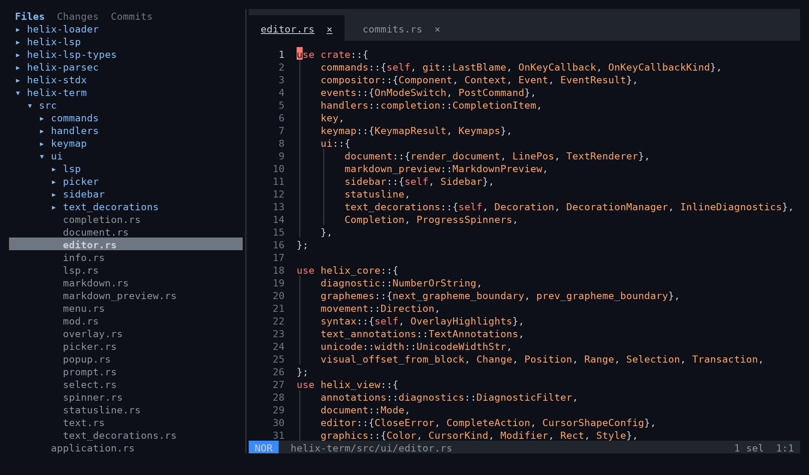

## Who it is for

- **People who work in the terminal, or on machines they reach over SSH**, and
  want a real editor there without learning vim first. sid is one file to
  install, needs no compiler or runtime on the machine, and copies to your own
  clipboard across SSH in terminals that allow it.
- **People who like modern editors' keys and panels** but want something that
  starts instantly and runs anywhere a terminal does.
- **Vim and Helix users** are welcome too: modal editing is all still there,
  one setting away. It is just not what you get by default.

## Why it exists

Terminal editors tend to make you choose. The powerful ones are modal: you
learn a new way of typing before you can be productive. The simple ones are
easy but stop at editing text: no tree, no git, no language server.

sid doesn't choose. It began as a fork of [Helix](https://github.com/helix-editor/helix)
— a fast, modern modal editor with excellent language support — to keep that
engine and change everything a newcomer meets: it opens in insert mode and stays
there, uses the keys every other editor uses, and puts the tools of a desktop IDE
on the screen. By now it is a different editor, so it has a name of its own:
**sid**, short and easy to type.

## A sidebar file tree

The editor's own keys — `Ctrl-q`, `Ctrl-s`, `F12` — work while the sidebar has
the focus.

`Ctrl-b` shows or hides it and `Ctrl-Shift-e` focuses it; started on a file
(`sid foo.ts`), the editor opens without it. It follows the file you are
editing, and `Ctrl-Shift-r` takes you to that file in the tree from wherever
you are. Inside it the arrows move, `Enter`
opens, and **typing walks to the file whose name you are typing**, the way an
explorer does; `Ctrl-f` opens a filter on the top row instead, and the tree
narrows to every file in the project whose path contains what you type, folded
away or not, shown under the folders on the way to it — `Esc` brings the whole
tree back, folded as it was. `Ctrl-n` creates (a name with
folders in it, `a/b/c.ts`, makes them; a name that would leave the project is
refused), `F2` renames, `Delete` deletes, and the right button offers the same
four on the row it lands on. A click opens a row, the wheel scrolls, and
dragging the line between the tree and the editor resizes it: the width is
remembered.

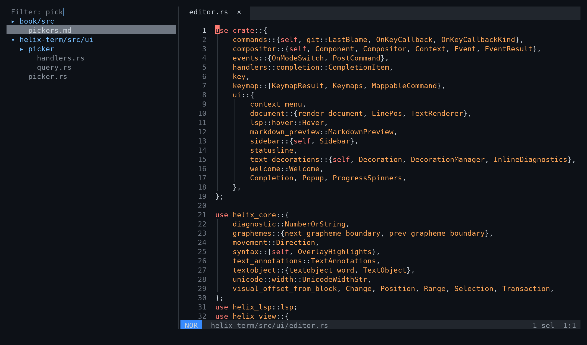

The tree reads the disk off to the side, never while drawing, and it notices
what happens there: a file a tool or git creates appears on its own within a
couple of seconds, with your folds and your place kept. `F5` reads everything
on screen again at once.

## What git sees changed

The **Changes** tab (`Tab` inside the sidebar) lists what `git status` names,
each file with its letter: modified, added, deleted, renamed. The letter sits in
git's own column — the left one when the change is staged, the right one when
it is not, both when it is some of each. `Enter` opens the file, and the gutter
marks the lines that changed.

`s` stages the file under the cursor, `u` takes it out of the index, and `d`
(or `Delete`) throws its working changes away after asking — an untracked file
is deleted, since git has nothing to get it back from. A file that is open is
read again from disk afterwards. The right button offers the same on the row it
lands on. The list is asked of git every couple of seconds while the tab is on
screen, and it stays where you scrolled it.

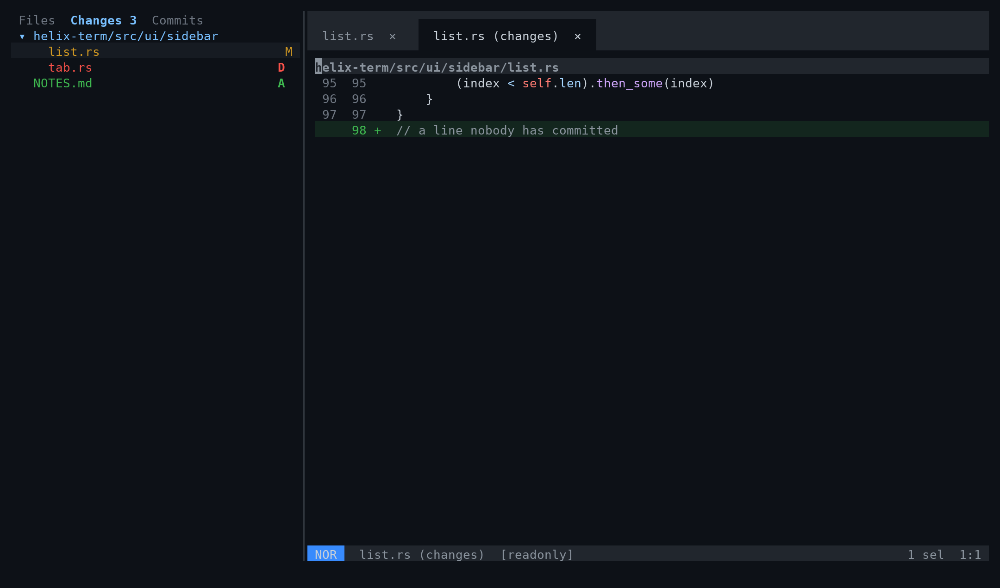

## The history, and each commit's diff

The **Commits** tab lists the history. A click on a commit shows its whole
diff in the editor; `Enter` or a double click lists the files it touched, the
diff then following whatever the cursor is on: a directory, one file. `Esc`
goes back. History sits above the changed files in one column; drag the divider
to resize either pane, or its outer edge to adjust the column width.

Diffs show filenames and highlighted code with old/new line numbers. `F4` toggles
the full historical file around the changes. Right-click for these controls,
or use `F6` / `F7` to show or hide commits / code.

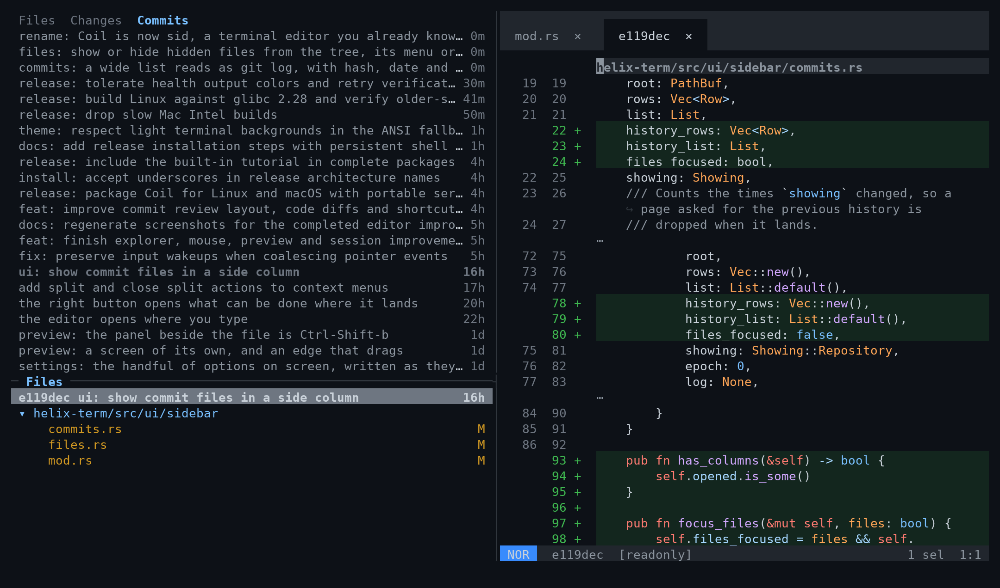

`Ctrl-Alt-l` narrows the history to the current file, following renames.

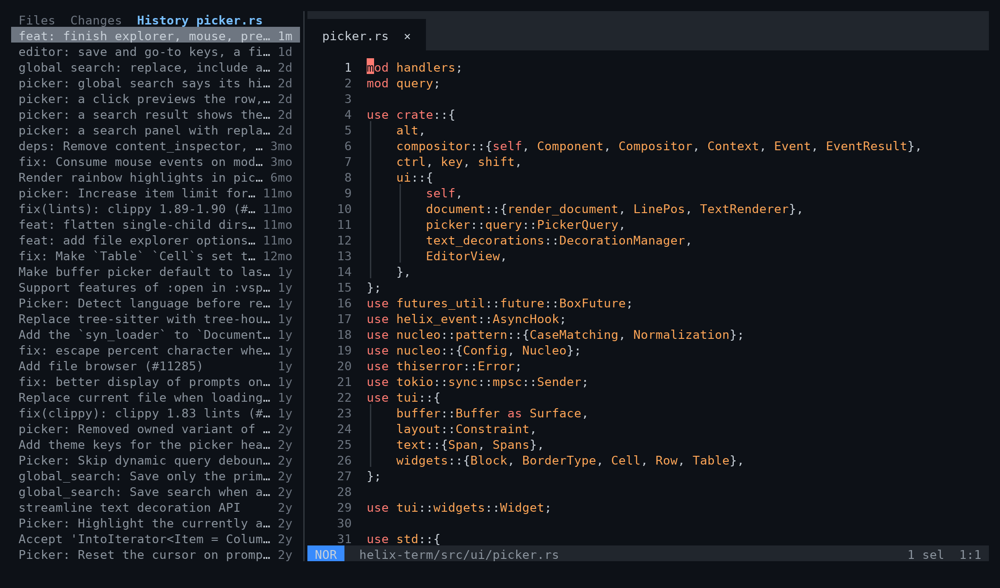

## Who changed this line

`Ctrl-Alt-b` says who last changed the line under the cursor, when, and in
which commit; press it again to open that commit in the sidebar.

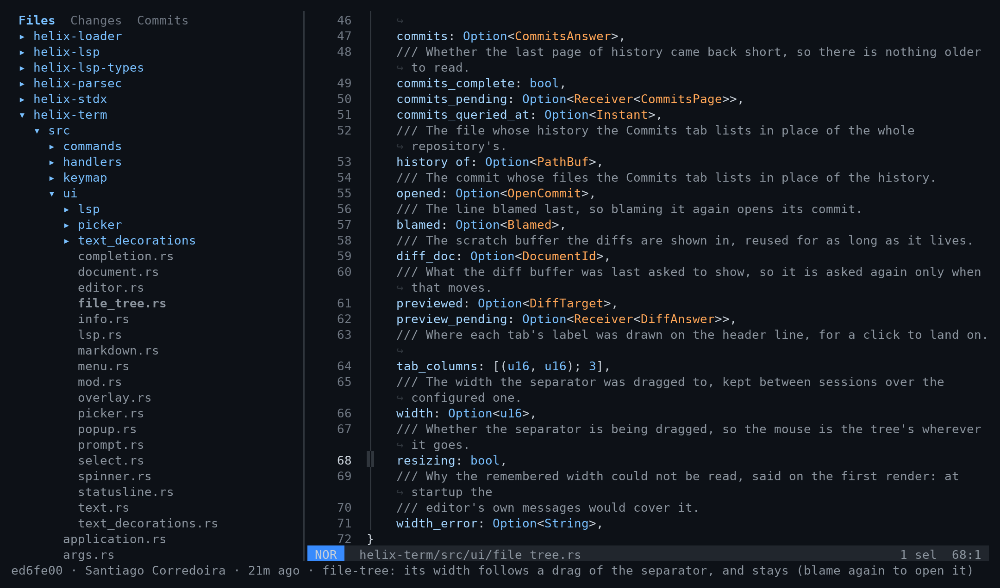

## Search and replace across the project

`Ctrl-Shift-f` opens a panel with a replace box and
include/exclude filters (the filters are remembered), switches for case, whole
word, regex and preserving case — the panel's border says their keys — and
each result shows the line it matched. `Alt-a` replaces every match on
screen: the files are changed but left unsaved, and one undo takes it back.

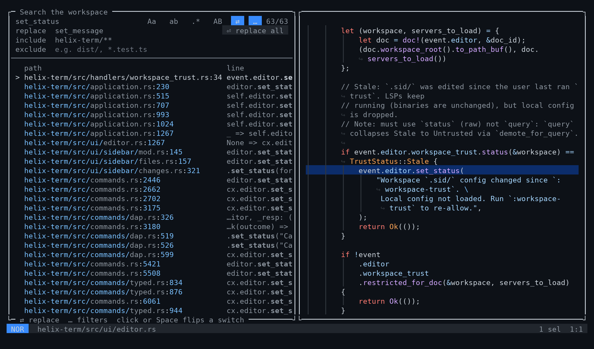

## Search and replace in this file

`Ctrl-f` opens the same panel on the file you are editing, its name on the
border: the matches listed by line, the file beside them, the same switches.
`Alt-a` replaces every match in it, unsaved, and one undo takes it back.
`Ctrl-g` asks for a line number and goes there, following it as you type.

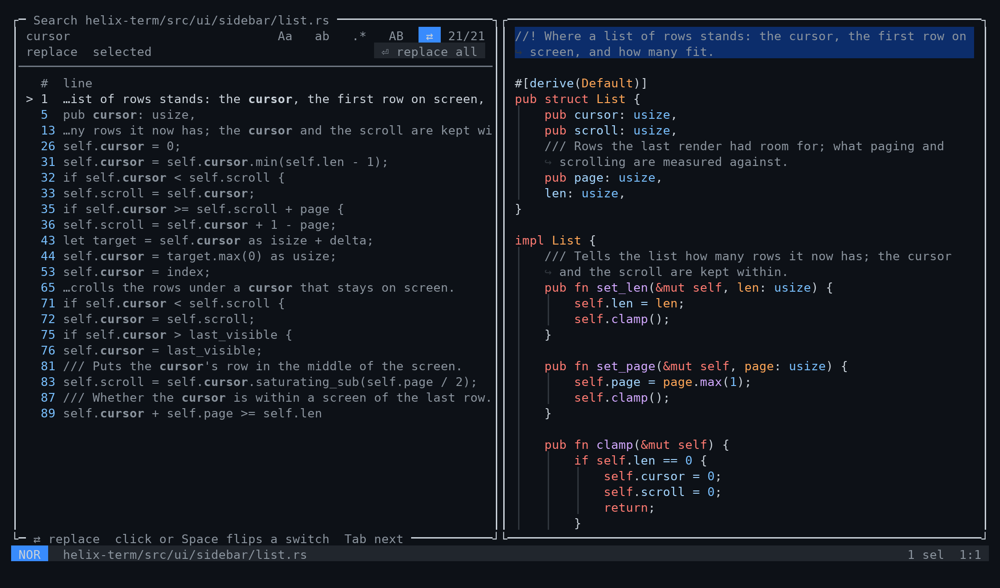

## Markdown, as it reads

`Ctrl-Shift-b` draws the Markdown file you are editing beside it: headings,
lists and tasks, quotes and GitHub's alerts, tables lined up, code
highlighted, all reflowed to the panel. It redraws once you pause typing and
keeps to the part of the file on screen; the wheel over it scrolls it on its
own until the file moves, and dragging the line between the file and the panel
resizes it: the width is remembered. A click on a link follows it: a file opens
in the editor, a `#heading` goes to that heading, and a web address opens in
the browser.

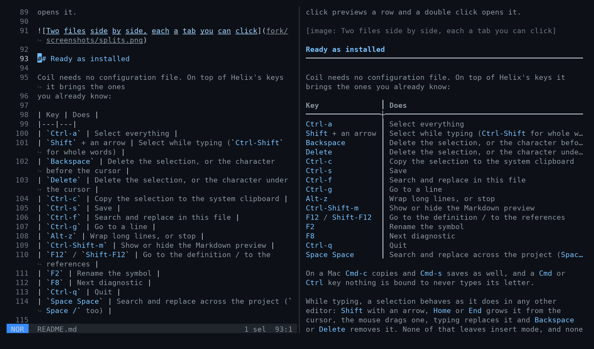

`Ctrl-Shift-m` gives it the whole screen instead, the text in a column of its
own width, as one more tab beside the file's: closing the tab is closing the
preview. There the arrows, `PageUp` and `PageDown`, `Home` and `End` scroll it
and `Escape` closes it. The editor's own shortcuts still work; nothing else
reaches the file behind it.

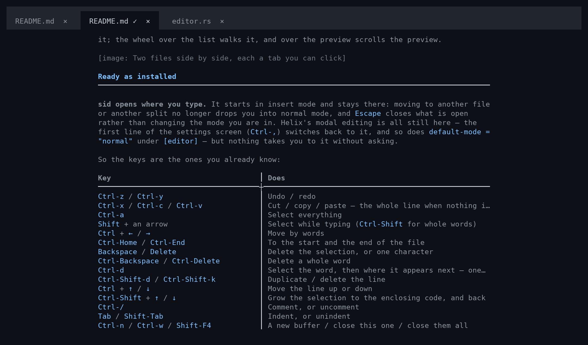

## Tabs, splits and the mouse

Buffers are tabs you can click, each with a cross that closes it, and there is a
tab even when only one file is open. Right-click a tab to split its file vertically
(side by side) or horizontally (stacked), keeping the current view open.
The right button in the editor opens what can be done where it landed:
cut, copy, paste, go to the definition, rename the
symbol, or split vertically or horizontally. With more than one pane open,
**Close split** closes the pane you right-clicked, keeping its file in the tabs.

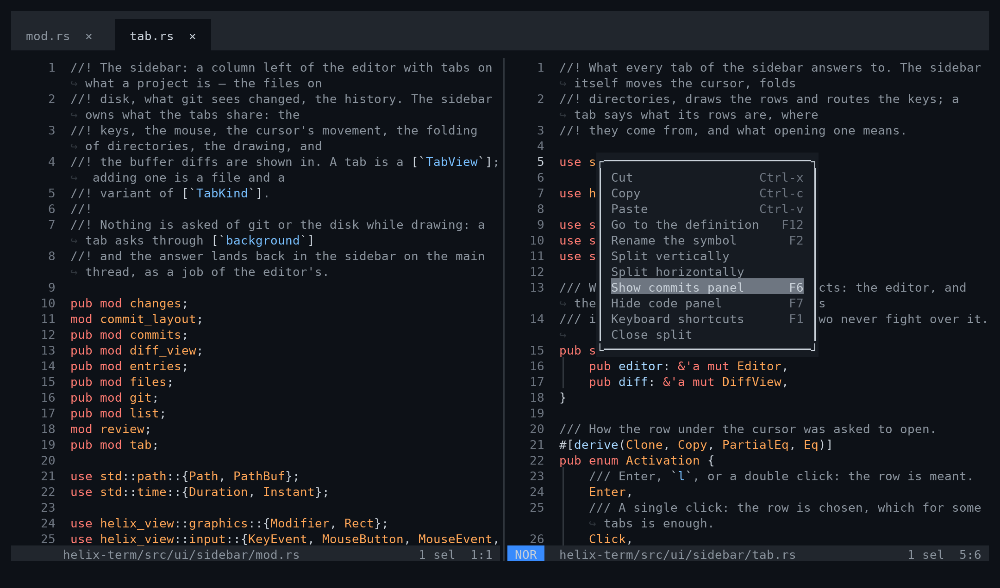

When the tabs do not all fit, the strip scrolls to keep the one you are on in
view, with `‹` and `›` at the edges where tabs are hidden: a click on one shifts
the strip by a tab, and the wheel over the tabs goes to the previous or the next
file.

In the text, a double click selects the word and a triple click the line, and
dragging from there grows the selection by words or by lines; what you type next
replaces it. `Ctrl`-click (`Cmd`-click where the terminal passes it on) goes to
the definition of what you clicked. Letting the pointer rest on a word shows what
the language server knows about it, and on a problem shows the problem first;
moving away closes it.

Opening the editor on a project — `sid`, or `sid .` — reopens what it had
open: the tabs in their order, the splits as they were, each with its cursor
where it was, and the one you were on in front. Naming a file opens that file
alone, and the settings screen turns it off altogether. Splits resize by dragging the line between two
side by side, or the status line between two stacked. In the pickers a click
previews a row and a double click opens it; the wheel over the list walks it,
and over the preview scrolls the preview.

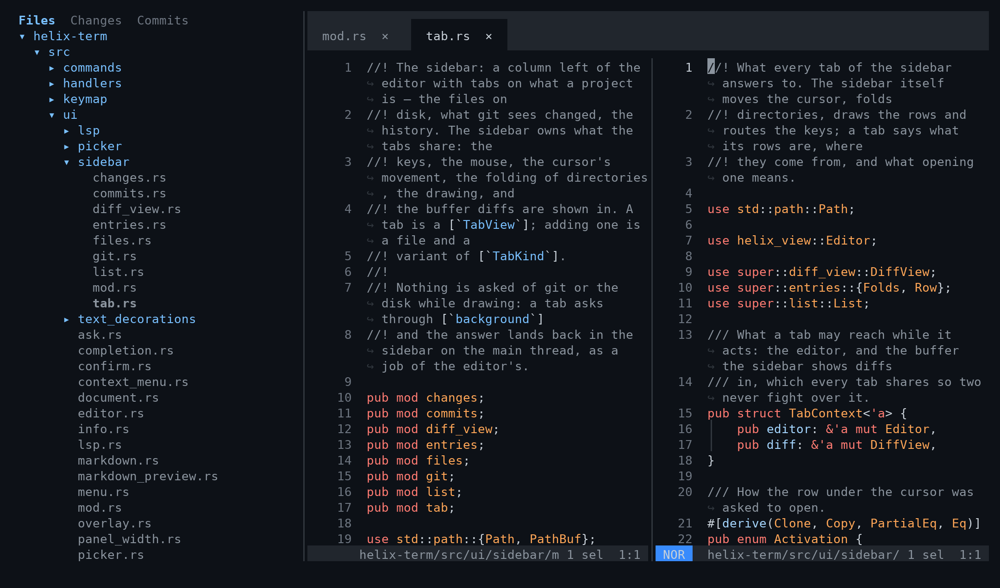

## Ready as installed

**sid opens where you type.** It starts in insert mode and stays there: moving
to another file or another split no longer drops you into normal mode, and
`Escape` closes what is open rather than changing the mode you are in. Helix's
modal editing is all still here — the first line of the settings screen
(`Ctrl-,`) switches back to it, and so does `default-mode = "normal"` under
`[editor]` — but nothing takes you to it without asking.

So the keys are the ones you already know:

| Key | Does |
|---|---|
| `Ctrl-z` / `Ctrl-y` | Undo / redo |
| `Ctrl-x` / `Ctrl-c` / `Ctrl-v` | Cut / copy / paste — the whole line when nothing is selected |
| `Ctrl-a` | Select everything |
| `Shift` + an arrow | Select while typing (`Ctrl-Shift` for whole words) |
| `Ctrl` + `←` / `→` | Move by words |
| `Ctrl-Home` / `Ctrl-End` | To the start and the end of the file |
| `Backspace` / `Delete` | Delete the selection, or one character |
| `Ctrl-Backspace` / `Ctrl-Delete` | Delete a whole word |
| `Ctrl-d` | Select the word, then where it appears next — one more caret each time |
| `Ctrl-Shift-d` / `Ctrl-Shift-k` | Duplicate / delete the line |
| `Ctrl` + `↑` / `↓` | Move the line up or down |
| `Ctrl-Shift` + `↑` / `↓` | Grow the selection to the enclosing code, and back |
| `Ctrl-/` | Comment, or uncomment |
| `Tab` / `Shift-Tab` | Indent, or unindent |
| `Ctrl-n` / `Ctrl-w` | A new buffer / close this one |
| `Ctrl-s` / `Ctrl-Shift-s` | Save / save under a name |
| `Ctrl-p` | Open a file by name |
| `Ctrl-Shift-p` | The command palette |
| `F1` | Searchable keyboard shortcut reference (including sidebar controls) |
| `F4` | Commit diff: full file context / changed sections |
| `F6` / `F7` | Show or hide the commits / code panel |
| `Ctrl-Alt-b` / `Ctrl-Alt-l` | Who changed this line / this file's history |
| `Ctrl-f` / `F3` / `Shift-F3` | Search in this file / next match / previous |
| `Ctrl-Shift-f` | Search and replace across the project |
| `Ctrl-g` | Go to a line |
| `Ctrl-Shift-o` / `Ctrl-t` | Go to a symbol in the file / in the project |
| `Ctrl-b` / `Ctrl-Shift-e` / `Ctrl-Shift-r` | The sidebar: show or hide / focus / reveal this file |
| `Ctrl-PageUp` / `Ctrl-PageDown` | The tab before / after this one |
| `Ctrl-\` | Split the editor |
| `F12` / `Shift-F12` | Go to the definition / to the references |
| `F2` | Rename the symbol |
| `F8` | Next diagnostic |
| `Alt-z` | Wrap long lines, or stop |
| `Ctrl-Shift-b` | Show or hide the Markdown preview beside the file |
| `Ctrl-Shift-m` | The Markdown preview on its own, filling the screen |
| `Ctrl-q` | Quit, asking about anything unsaved |
| `Ctrl-,` | Settings |

A `Cmd` or `Ctrl` key nothing is bound to never types its letter, and on a Mac
`Cmd-z`, `Cmd-x`, `Cmd-c`, `Cmd-b` and `Cmd-Shift-f` do what their `Ctrl` twins
do — in the terminals that forward `Cmd` at all, since many keep it for their
own menus.

Where a keyboard puts `/`, `\` or `]` behind another key — a Spanish layout does
— the editor sees the key that was actually pressed, so `Ctrl-/` is bound to the
`7` key and `Ctrl-\` to `º`. Everything is in `defaults.toml`, laid under your
own `config.toml` — and a key meant for every mode is written once, under
`[keys.all]`, in that file and in yours alike; a mode's own table wins over it.

While typing, a selection behaves as it does in any other editor: `Shift` with
an arrow, `Home` or `End` grows it from the cursor, the mouse drags one, typing
replaces it and `Backspace` or `Delete` removes it. None of that leaves insert
mode, and none of it touches how selections work outside it, where they are what
the commands act on.

Nothing is written for you: `Ctrl-s` saves, and what has changes is asked about
before it can be lost — closing a tab, closing them all, quitting. The settings
screen turns on writing a file when you leave it, or while you type, if you
would rather it were.

The one thing that cannot be written for you is a buffer with no file behind it
— `Ctrl-n` opens one — and that is asked about rather than refused: saving it
puts a field in the middle of the screen for the name, and a name with
directories in it makes them on the way. Quitting and closing everything ask the
same way, one buffer after the next, and throwing the changes away is always an
answer somebody chose.

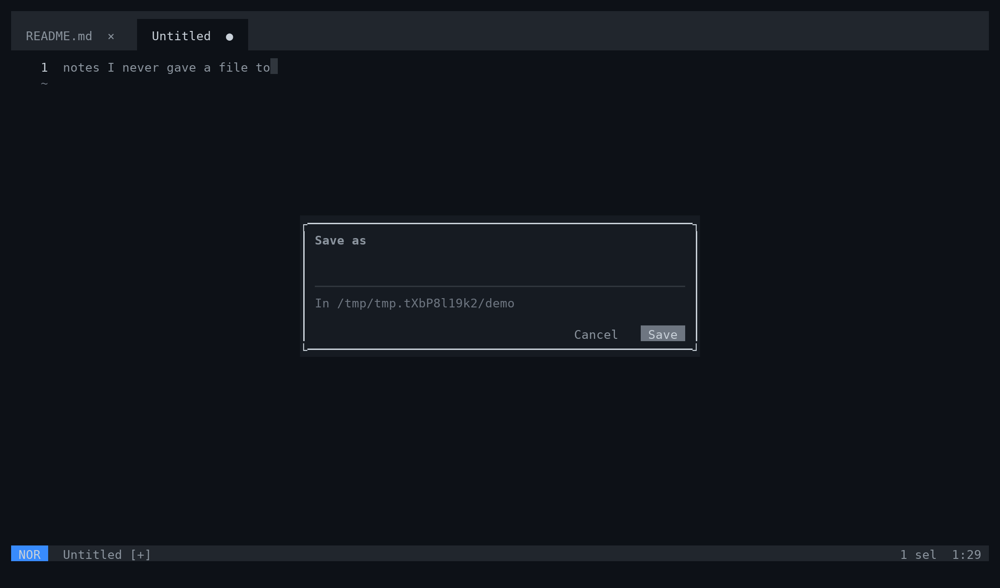

Every question is answered the same: arrows or `Tab` walk the answers, `Enter`
takes the one in focus, a click takes the one it lands on, and `Escape` always
answers no.

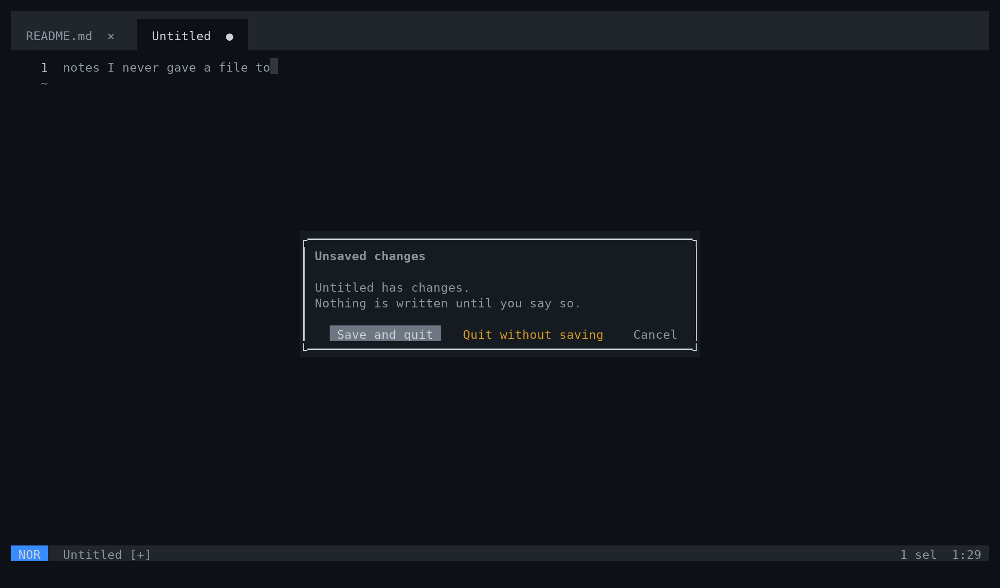

And the editor starts the way you would set it up: long lines wrap,
indentation guides show, open files are tabs, the cursor is a bar while
typing, the mode colours the status line, the theme follows the terminal's
light or dark background, the file picker shows ignored files too, and
completion offers only what the language server suggests.

Any of it can be changed in `~/.config/sid/config.toml`, which is laid over
these defaults: write only what you want different.

Copying over SSH reaches your own machine's clipboard when the terminal
supports OSC 52: Ghostty, kitty and WezTerm do, iTerm2 once it is allowed in
its settings.

## Settings on the screen

`Ctrl-,` opens the handful of settings a newcomer reaches for, each showing what
it is set to now: wrapping, saving, line numbers, tabs, the mouse. Up and down
walk them, `Space` or a click changes the one in focus, and the change applies at
once and is written to `~/.config/sid/config.toml` as it is made — only the line
it touches, so the rest of the file, comments included, stays as you wrote it.

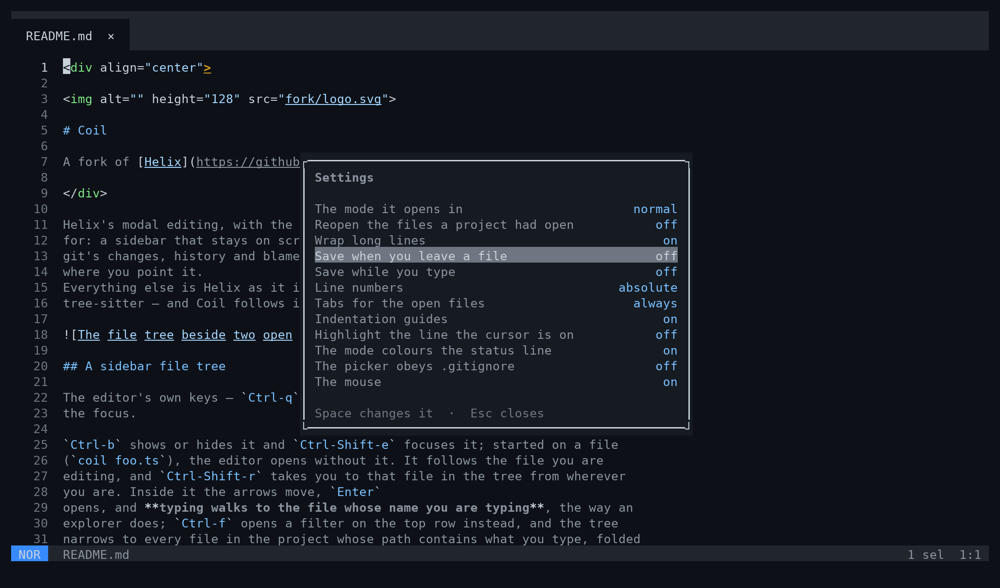

## Find a shortcut

`F1` opens a centered reference over the editor. Type to search your configured
shortcuts, use `Tab` to filter by mode or sidebar, and `Esc` to close it.

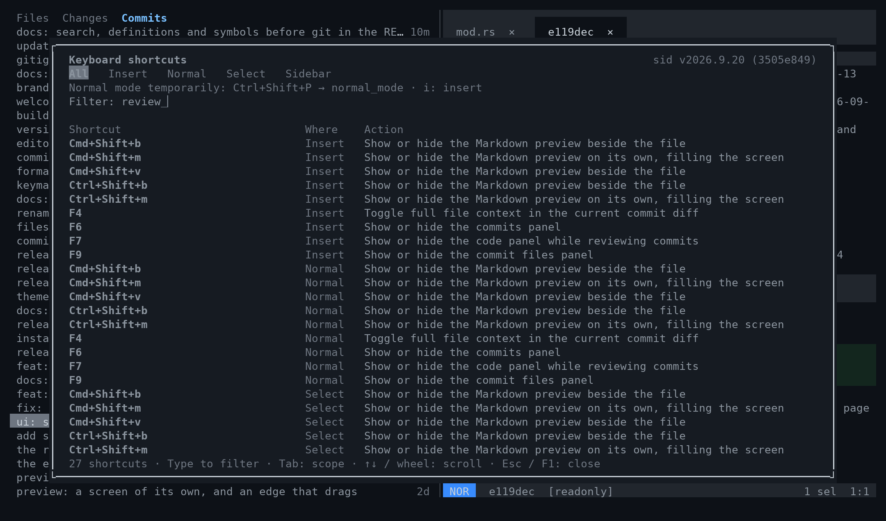

For a temporary visit to normal mode, open `Ctrl-Shift-P`, run `normal_mode`,
and press `i` when you want to type again. This leaves your settings alone.

## If you know Helix

The keys are Helix's, and so is its documentation:
[docs.helix-editor.com](https://docs.helix-editor.com/) applies as it is —
except for the keys above: `Ctrl-c` copies (comment with `Space c`), `Ctrl-a`
selects everything (incrementing a number keeps no key), `Ctrl-s` saves and
`Ctrl-f` searches the file (a page down is `PageDown`) — and that while typing
a selection is replaced by what you type, which Helix leaves alone. sid keeps
its own files, so the two never mix:

| | Helix | sid |
|---|---|---|
| Command | `hx` | `sid` |
| Configuration | `~/.config/helix/` | `~/.config/sid/` |
| Per project | `.helix/` | `.sid/` |
| Runtime override | `HELIX_RUNTIME` | `SID_RUNTIME` |

To bring your configuration along: `cp -r ~/.config/helix ~/.config/sid`.

## Installing

Download the [latest release](https://github.com/scorredoira/sid/releases/latest)
for Linux x86_64/ARM64 or macOS Apple Silicon, or let the installer select it:

```sh
curl -fsSL https://raw.githubusercontent.com/scorredoira/sid/master/fork/install.sh -o /tmp/install-sid.sh
sh /tmp/install-sid.sh
export PATH="$HOME/.local/bin:$PATH"
sid
```

This installs the complete package under `~/.local`, verifies the archive's
SHA-256 checksum and preserves your configuration. Repeat to update. No Rust,
Homebrew or compiler is needed on the destination machine. To keep sid on PATH in future terminals, run this once for macOS's default
zsh shell:

```sh
printf '\nexport PATH="$HOME/.local/bin:$PATH"\n' >> ~/.zshrc
```

For bash on Linux, use `~/.bashrc` instead:

```sh
printf '\nexport PATH="$HOME/.local/bin:$PATH"\n' >> ~/.bashrc
```

Language servers and formatters
are installed separately; `sid --health` shows which are available.

For servers, the Linux `.run` asset is a single transferable file: rename it
`sid`, run `chmod +x sid`, and copy it to a directory on PATH. It includes the
same runtime, extracted to a user cache on first use, with no FUSE requirement.
Linux builds require glibc 2.28+ (Ubuntu 20.04+, Debian 10+); macOS builds require
macOS 14+. Choose the asset matching the machine's architecture.

To use it as your default editor, set `EDITOR=sid` and `VISUAL=sid`. An optional
`alias vim=sid` affects interactive use; sid does not emulate Vim's CLI.

### Building from source

Building needs [Rust](https://rustup.rs), git and a C
compiler, which builds the tree-sitter grammars (on macOS,
`xcode-select --install`).

```sh
git clone https://github.com/scorredoira/sid
cd sid
cargo install --path helix-term --locked
mkdir -p ~/.config/sid
ln -sfn "$PWD/runtime" ~/.config/sid/runtime
```

The first build fetches and compiles every grammar, so it takes a few
minutes. `sid` lands in `~/.cargo/bin`, which rustup puts on your `PATH`;
`sid --health` says where it reads its configuration from. The `runtime`
link keeps the clone as the source of the grammars and themes, so leave it
where it is.

To update: `git pull` in the clone, then the `cargo install` line again.

## Following Helix

sid is rebased onto Helix's `master` regularly, so Helix's fixes and features
arrive here too. Problems with sid belong in
[this repository's issues](https://github.com/scorredoira/sid/issues), not
in Helix's.

## License

[MPL-2.0](LICENSE), like Helix. The editor underneath is the work of
[Helix's contributors](https://github.com/helix-editor/helix/graphs/contributors).
